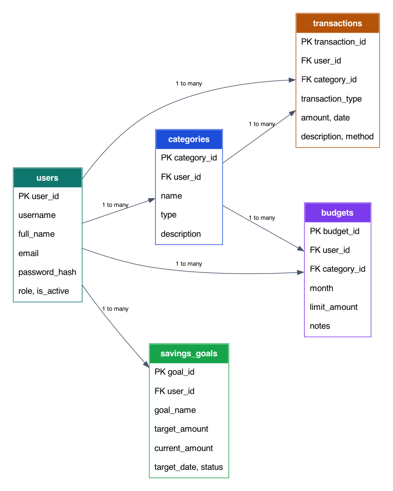
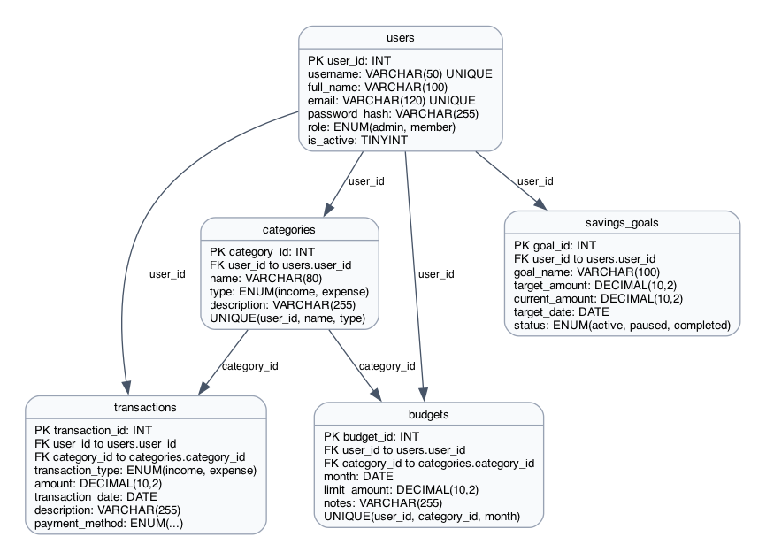

# Personal Budget Tracker System

A Python and MySQL database application for recording income, expenses, budgets, and savings goals. The system is built with Flask, MySQL Connector/Python, and XAMPP MySQL using the required `CCCS105` database configuration.

## Introduction

### Background

Many students and households track money using notebooks, spreadsheets, or phone notes. These methods work at first, but they become harder to maintain when there are many income sources, expenses, budget limits, and savings goals. The Personal Budget Tracker System provides one database-backed application where users can store and manage their financial records.

### Problem Statement

Users need a simple way to organize personal finance records, check spending, and monitor savings progress. Without a structured system, it is easy to lose records, duplicate entries, or forget whether a category has exceeded its budget.

### Scope

The project covers login authentication, category management, transaction CRUD, monthly budgets, savings goals, search/filtering, and CSV export. It does not include online banking integration, mobile app deployment, automatic receipt scanning, or real payment processing.

### Target Users

The target users are students, young professionals, and household members who need a simple local web application for managing personal income and expenses.

## Project Objectives

### Primary objective:

Create a Python-based database application that can access, store, update, delete, search, and export personal budget records from a MySQL database.

### Secondary objectives:

- Connect Flask to XAMPP MySQL using MySQL Connector/Python.
- Provide a user-friendly web interface for database operations.
- Apply CRUD operations to related tables such as users, categories, transactions, budgets, and savings goals.
- Validate user input before saving data to prevent invalid records.
- Provide search and CSV export for transaction records.
- Document the database design through ERD and relational model diagrams.

## Business Rules

### Detailed Business Logic

- Visitors can create a member account from the login page.
- Only active users can log in.
- A user can view and manage only their own categories, transactions, budgets, and savings goals.
- Newly registered users receive default income and expense categories.
- Categories must be either `income` or `expense`.
- A transaction must belong to one user and one matching category.
- Income transactions must use income categories; expense transactions must use expense categories.
- Transaction, budget, and savings amounts must be valid positive numbers, except savings current amount, which can be zero.
- A budget can only be created for an expense category.
- Only one budget is allowed for the same user, category, and month.
- A category cannot be deleted if it is already used by transactions or budgets.
- A savings goal becomes completed when the current amount reaches or exceeds the target amount.
- CSV export uses the same filters currently applied on the transaction page.

### Constraints

- The application uses MySQL database name `CCCS105`.
- Default local database credentials follow the XAMPP setup: username `root` and empty password.
- Sensitive credentials must be stored in `.env`, not committed to Git.
- The application requires Python 3.x and a running MySQL server.
- The database must be imported before logging in.

### Conditions

- Users must log in before accessing dashboard and CRUD pages.
- Session data is cleared during logout.
- Invalid form data is rejected with a visible message.
- Delete actions require confirmation in the browser.
- If MySQL is not running, the application displays a database error page.

## Database Models

### Entity Relationship Diagram



The database has five main entities. One user can own many categories, transactions, budgets, and savings goals. Categories are connected to transactions and budgets so financial records remain organized by income or expense type.

### Relational Model



Tables and attributes:

- `users(user_id, username, full_name, email, password_hash, role, is_active, created_at)`
- `categories(category_id, user_id, name, type, description, created_at)`
- `transactions(transaction_id, user_id, category_id, transaction_type, amount, transaction_date, description, payment_method, created_at, updated_at)`
- `budgets(budget_id, user_id, category_id, month, limit_amount, notes, created_at, updated_at)`
- `savings_goals(goal_id, user_id, goal_name, target_amount, current_amount, target_date, status, notes, created_at, updated_at)`

## Project Overview

The application follows a simple MVC-style structure:

- Model layer: MySQL tables and SQL queries in `database/` and `src/db.py`.
- View layer: HTML templates in `src/templates/` and CSS/JS in `src/static/`.
- Controller layer: Flask route modules in `src/routes/`.

Key components:

- Authentication routes for login and logout.
- Registration route for creating member accounts.
- Dashboard route for totals, recent transactions, budget usage, and savings progress.
- CRUD routes for categories, transactions, budgets, and savings goals.
- Search and export route for filtered transaction data.

## Setup Instructions

### Prerequisites

- Python 3.10 or newer
- XAMPP with MySQL running
- Git
- Web browser
- phpMyAdmin or MySQL command line

### Installation

1. Clone the repository.

   ```bash
   git clone <repository-url>
   cd Personal-Budget-Tracker-System
   ```

2. Create and activate a virtual environment.

   ```bash
   python3 -m venv .venv
   source .venv/bin/activate
   ```

   On Windows:

   ```bash
   python -m venv .venv
   .venv\Scripts\activate
   ```

3. Install dependencies.

   ```bash
   pip install -r requirements.txt
   ```

4. Configure environment variables.

   ```bash
   cp .env.example .env
   ```

   Default configuration:

   ```text
   MYSQL_HOST=localhost
   MYSQL_PORT=3306
   MYSQL_DATABASE=CCCS105
   MYSQL_USER=root
   MYSQL_PASSWORD=
   ```

5. Start XAMPP MySQL.

6. Import the database.

   Using phpMyAdmin:

   - Open `http://localhost/phpmyadmin`.
   - Import `database/schema.sql`.
   - Import `database/initial_data.sql`.

   Using MySQL command line:

   ```bash
   mysql -u root < database/schema.sql
   mysql -u root CCCS105 < database/initial_data.sql
   ```

7. Run the application.

   ```bash
   python -m src.app
   ```

8. Open the application in the browser.

   ```text
   http://127.0.0.1:5000
   ```

## Team Members and Roles

| Member | Role | Responsibilities |
|-----|-----|-----|
| Nash Sabas          | Database Designer | Schema design, seed data|
| Arvin Joshua Opiana | Diagram & Documentation | ERD, Relational Model, Documentation |
| Renz Angelo Priela  | Backend & Frontend | CRUD Routes, HTML/CSS, Flas setup, Database Connection|

## Dependencies

Python packages:

- Flask 3.1.2
- mysql-connector-python 9.1.0
- python-dotenv 1.0.1
- Werkzeug 3.1.3

System requirements:

- Python 3.10 or newer
- XAMPP MySQL or MySQL Server 8.x
- Browser such as Chrome, Edge, Firefox, or Safari
- Git for repository management

## Running Instructions

Start the application:

1. Open XAMPP Control Panel → Start Apache and MySQL
2. Activate the virtual environment:
```bash
source .venv/bin/activate
```
3. Run the application
```bash
python3 -m src.app
```

Stop the application:

- Press `Ctrl + C` in the terminal running Flask.

Default Login Credentials:

| Username | Password | Role |
|---|---|---|
| admin | password123 | admin |
| juan | password123 | member |
| maria | password123 | member |

Main navigation:

- Create Account: register a new member account from the login page.
- Dashboard: view totals, monthly summary, recent transactions, budgets, and savings goals.
- Transactions: add, edit, delete, search, filter, and export income/expense records.
- Categories: manage income and expense categories.
- Budgets: create monthly expense limits.
- Savings Goals: track target savings and progress.
